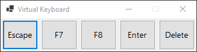

# VirtualKeyboard

Always on top window with specified virtual keys.

Not activated on click, so can send buttons to the currently active window.

Useful for a remote desktop session from a touch device.

This is a Windows Forms application.



## Configuration:

``` xml
<add key="Keys" value="Escape,F7,F8,Enter,Delete" />
<add key="ButtonWidth" value="60" />
<add key="ButtonHeight" value="50" />
<add key="FontSize" value="10" />
```

`Keys` are enum values ​​from:

https://learn.microsoft.com/en-us/dotnet/api/system.windows.forms.keys?view=windowsdesktop-9.0
